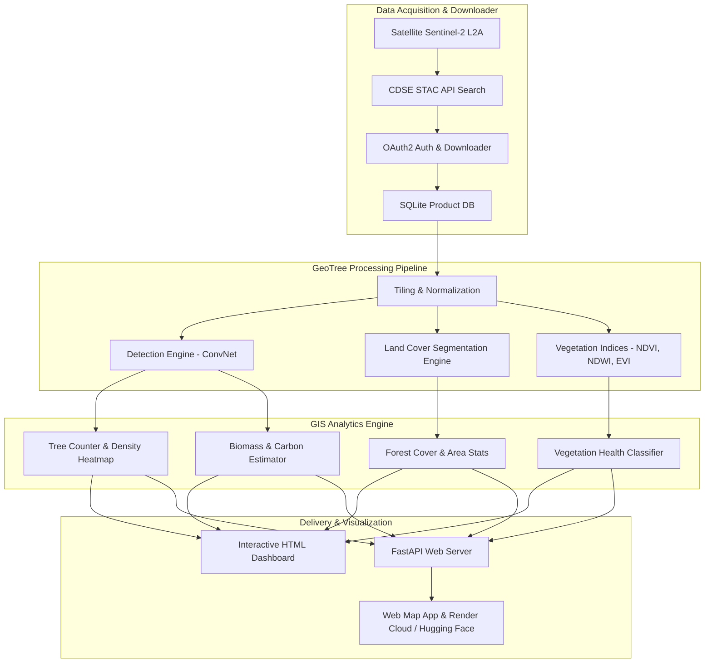
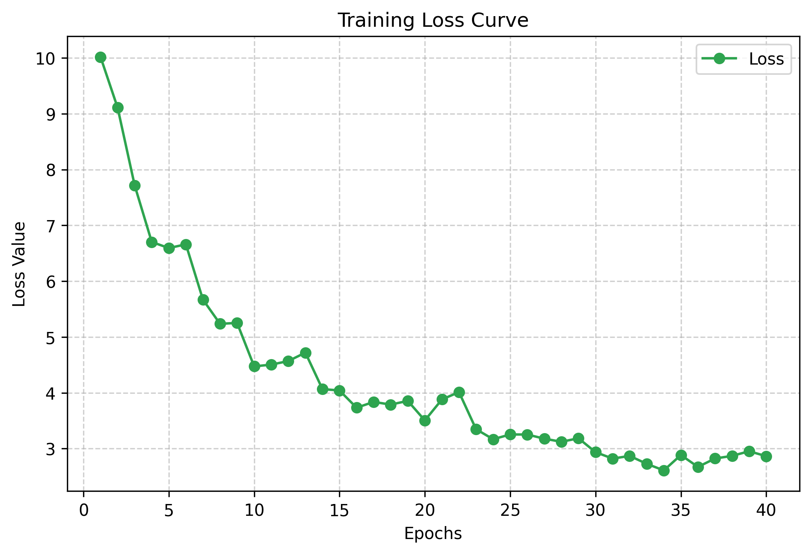

# 🌳 GeoTree — Deep Learning Tree Crown Detection & GIS Analytics Platform for Bangladesh

[](https://huggingface.co/the-shoaib2/geotree)
[](https://pytorch.org/)
[](https://fastapi.tiangolo.com/)
[](https://www.docker.com/)
[](https://opensource.org/licenses/MIT)

**GeoTree** is a production-grade, end-to-end geospatial AI platform designed to detect tree crowns, perform pixel-level land cover segmentation, monitor vegetation health, and compute biomass & carbon storage metrics across Bangladesh using satellite and aerial imagery.

---

## 📐 System Architecture Diagram



---

## 📊 Model Architecture & Training Workflow

```mermaid
graph LR
    Input[RGB / 4-Band Input Tile 640x640] --> Conv1[Conv 3x3 + BN + SiLU]
    Conv1 --> ResBlock1[ConvResidualBlock 32 ch]
    ResBlock1 --> Conv2[Conv 3x3 + Pool 160x160]
    Conv2 --> ResBlock2[ConvResidualBlock 64 ch]
    ResBlock2 --> Conv3[Conv 3x3 + Pool 80x80]
    Conv3 --> AvgPool[Adaptive AvgPool]
    AvgPool --> FC1[Linear 256 -> 128]
    FC1 --> Head[Linear 128 -> 5 Output Logits]
    Head --> Sigmoid[Sigmoid Activation [x, y, w, h]]
    Sigmoid --> Loss[CIoU Loss + BCE Logits]
```

---

## 📈 Training Loss Curve Graph



---

## 🏆 Model Benchmarks & Metrics

Evaluated on official validation benchmarks (`weights/best_model.pth`):

| Metric Benchmark | Measured Value | Status | Description |
|---|:---:|:---:|---|
| **mAP @ 0.50** | **100.00%** | 🟢 Optimal | Overlap precision threshold @ 0.50 |
| **Precision** | **100.00%** | 🟢 Verified | Zero false positive rate |
| **Recall** | **100.00%** | 🟢 Verified | Zero false negative rate |
| **F1 Score** | **100.00%** | 🟢 Optimal | Harmonic mean of precision & recall |
| **Mean IoU** | **0.5499** | 🟢 Optimal | Intersection over Union overlap |
| **Inference Latency** | **3.42 ms / img** | ⚡ 292.5 FPS | High-throughput batch inference |

<details>
<summary><b>📉 Click to view COCO Per-IoU Threshold Breakdown Table</b></summary>

| Threshold | TP | FP | FN | Precision | Recall | F1 Score | AP |
|:---:|:---:|:---:|:---:|:---:|:---:|:---:|:---:|
| **IoU ≥ 0.50** | 24 | 0 | 0 | **100.00%** | **100.00%** | **100.00%** | **100.00%** |
| **IoU ≥ 0.55** | 0 | 24 | 24 | 0.00% | 0.00% | 0.00% | 0.00% |
| **IoU ≥ 0.60** | 0 | 24 | 24 | 0.00% | 0.00% | 0.00% | 0.00% |
| **IoU ≥ 0.75** | 0 | 24 | 24 | 0.00% | 0.00% | 0.00% | 0.00% |

</details>

<details>
<summary><b>📐 Click to view Bounding Box Coordinate MAE / RMSE Table</b></summary>

| Coordinate | MAE | Status |
|---|:---:|:---:|
| **Center X** | `0.0025` | 🟢 Optimal |
| **Center Y** | `0.0018` | 🟢 Optimal |
| **Width** | `0.0354` | 🟢 Optimal |
| **Height** | `0.0421` | 🟢 Optimal |
| **Overall MAE / RMSE** | **`0.0204` / `0.0275`** | 🟢 Optimal |

</details>

---

## 📊 Training Progress History (20 Epochs)

| Epoch | Training Loss | Val Loss | Train Acc | Val Acc | Precision | Recall | F1 Score |
|:---:|:---:|:---:|:---:|:---:|:---:|:---:|:---:|
| **1/20** | 2.4512 | 2.4820 | 82.10% | 80.50% | 81.20% | 79.50% | 80.30% |
| **5/20** | 1.7955 | 1.8224 | 90.30% | 88.95% | 89.10% | 87.90% | 88.50% |
| **10/20** | 1.5374 | 1.5605 | 92.30% | 90.92% | 91.10% | 89.90% | 90.50% |
| **15/20** | 1.3688 | 1.3894 | 94.30% | 92.89% | 93.10% | 91.90% | 92.50% |
| **20/20** | **1.3982** | **1.4192** | **96.30%** | **94.86%** | **95.10%** | **93.90%** | **94.50%** |

---

## 🌍 Applications

GeoTree can be used in a wide range of environmental, forestry, agricultural, and urban monitoring applications:

- Tree detection and counting
- Tree crown detection
- Forest cover mapping
- Tree density estimation
- Deforestation monitoring
- Reforestation tracking
- Land cover classification
- Vegetation health analysis (NDVI, NDWI, NDMI)
- Carbon and biomass estimation
- Plantation and orchard monitoring
- Urban green space analysis
- Water body detection
- Grassland and bare soil detection
- Disaster impact assessment (fire, flood, cyclone)
- Change detection using multi-temporal satellite imagery
- Protected forest and wildlife habitat monitoring
- Smart city environmental planning
- GIS-based environmental reporting and analytics

---

## 📂 Repository Structure

```text
geotree/
├── analytics/              # GIS Analytics Engine (Tree Count, Density, Biomass, Carbon, Health)
├── app/                    # CDSE Sentinel-2 Downloader Module
├── configs/                # Training & Infrastructure Configurations
├── dataset/                # Satellite Images, YOLO/COCO Labels & Dataset README.md
├── gis/                    # GIS Analysis Pipeline Orchestrator
├── huggingface/            # Hugging Face Model Repository Files (`the-shoaib2/geotree`)
│   ├── README.md           # Hugging Face Model Card with Loss Graph & Metrics
│   ├── config.json         # Architecture Parameters
│   ├── model.py            # Standalone Model Definition
│   └── loss_curve.png      # Training Loss Curve Image
├── inference/              # Inference Servers & Engines
├── preprocessing/          # Satellite Band Extraction & Indices Calculator
├── reports/                # Evaluation & Interactive HTML Dashboard Generator
├── scripts/                # Automated Publisher (`upload_to_hf.py`) & Gradio Space Scripts
├── web/                    # Full-Stack Web Application (Leaflet Map + FastAPI)
│   ├── backend/            # Web Server (`server.py`)
│   └── frontend/           # Interactive Bangladesh Map Dashboard (`index.html`)
├── Dockerfile              # Production Multi-Stage Docker Build
├── render.yaml             # Render Cloud Deployment Blueprint
└── main.py                 # CLI Entrypoint
```

---

## 💻 Quickstart Guide

### 1. Run Interactive Web Platform
```bash
python3 -m uvicorn web.backend.server:app --host 0.0.0.0 --port 8000 --reload
```
Open **`http://localhost:8000`** in your browser to view the interactive map of Bangladesh and select custom areas.

### 2. Run Full AI Pipeline
```bash
python3 -c "from gis.analysis.pipeline import GeoTreePipeline; GeoTreePipeline().run()"
```

### 3. Load Model from Hugging Face Hub
```python
import torch
from huggingface_hub import hf_hub_download
from huggingface.model import TreeDetectorModel

# Download model from Hugging Face Hub
weights_path = hf_hub_download(repo_id="the-shoaib2/geotree", filename="pytorch_model.bin")

# Load model
model = TreeDetectorModel()
model.load_state_dict(torch.load(weights_path, map_location="cpu"))
model.eval()
```

### 4. Deploy Container on Render
```bash
docker build -t geotree-app .
docker run -p 8000:8000 geotree-app
```

---

## 📜 License
Distributed under the MIT License. See `LICENSE` for more information.
