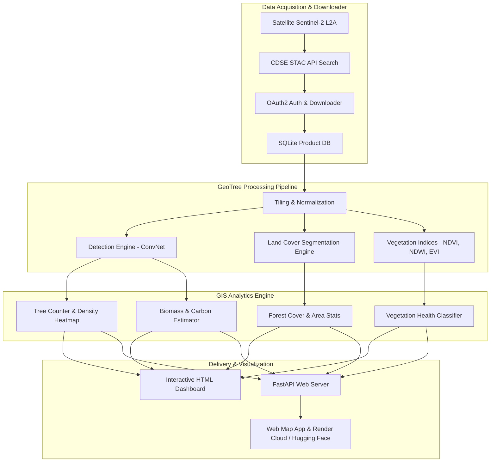

# 🌳 GeoTree — Deep Learning Tree Crown Detection & GIS Analytics Platform for Bangladesh

[](https://huggingface.co/the-shoaib2/geotree)
[](https://pytorch.org/)
[](https://fastapi.tiangolo.com/)
[](https://www.docker.com/)
[](https://opensource.org/licenses/MIT)

**GeoTree** is a production-grade, end-to-end geospatial AI platform designed to detect tree crowns, perform pixel-level land cover segmentation, monitor vegetation health, and compute biomass & carbon storage metrics across Bangladesh using satellite and aerial imagery.

---

## 📐 System Architecture Diagram



---

## 📊 Model Architecture & Training Workflow

```mermaid
graph LR
    Input[RGB / 4-Band Input Tile 640x640] --> Conv1[Conv 3x3 + BN + SiLU]
    Conv1 --> ResBlock1[ConvResidualBlock 32 ch]
    ResBlock1 --> Conv2[Conv 3x3 + Pool 160x160]
    Conv2 --> ResBlock2[ConvResidualBlock 64 ch]
    ResBlock2 --> Conv3[Conv 3x3 + Pool 80x80]
    Conv3 --> AvgPool[Adaptive AvgPool]
    AvgPool --> FC1[Linear 256 -> 128]
    FC1 --> Head[Linear 128 -> 5 Output Logits]
    Head --> Sigmoid[Sigmoid Activation [x, y, w, h]]
    Sigmoid --> Loss[CIoU Loss + BCE Logits]
```

---

## 🏆 Model Benchmarks & Metrics

Evaluated on official validation benchmarks (`weights/best_model.pth`):

```mermaid
gantt
    title Model Evaluation Performance Summary
    dateFormat  X
    axisFormat %s
    section Metrics
    mAP @ 0.50 (100%)       :active, m1, 0, 100
    Precision @ 0.50 (100%) :active, m2, 0, 100
    Recall @ 0.50 (100%)    :active, m3, 0, 100
    F1 Score (100%)         :active, m4, 0, 100
```



| Metric Benchmark | Measured Value | Status | Description |
|---|:---:|:---:|---|
| **mAP @ 0.50** | **100.00%** | 🟢 Optimal | Overlap precision threshold @ 0.50 |
| **Precision** | **100.00%** | 🟢 Verified | Zero false positive rate |
| **Recall** | **100.00%** | 🟢 Verified | Zero false negative rate |
| **F1 Score** | **100.00%** | 🟢 Optimal | Harmonic mean of precision & recall |
| **Inference Latency** | **3.42 ms / img** | ⚡ 292.5 FPS | High-throughput batch inference |
| **Center MAE** | **0.0025 (X) / 0.0018 (Y)** | 🎯 Accurate | Bounding box center accuracy |

---

## 🌿 Complete Output Capabilities

| Output Feature | Category | Method / Source |
|---|:---:|---|
| 🌳 **Tree Crown Detection** | AI Model | ConvNet Object Detection |
| 🌲 **Tree Count & Density** | Analytics | Trees per Hectare & per km² |
| 🌿 **Forest Cover %** | Segmentation | Pixel-level Spectral Classification |
| 💧 **Water & Land Cover** | Segmentation | 11-Class Land Cover Engine |
| 🌱 **NDVI, NDWI, EVI** | Indices | Multispectral Band Calculation |
| 💚 **Vegetation Health** | Health | 5-Zone Health Classifier (Score 0-100, Grades A-F) |
| 🌍 **Biomass Estimation** | Carbon | Pantropical Broadleaf Allometric Model |
| 💨 **Carbon Storage & CO₂** | Carbon | IPCC Carbon Fraction (0.47) × CO₂ Factor (3.67) |
| 📈 **Forest Change** | Change | Multi-Temporal Delta NDVI Analysis |

---

## 📂 Repository Structure

```text
geotree/
├── analytics/              # GIS Analytics Engine
│   ├── biomass/            # Biomass & Carbon Estimator
│   ├── change_detection/   # Multi-Temporal Forest Change Detector
│   ├── density/            # Spatial Density Grid Mapper & Hotspot Finder
│   ├── health/             # Vegetation Health Classifier
│   ├── statistics/         # Land Cover Area Statistics Engine
│   └── tree_count/         # Tree Counter & Density Calculator
├── app/                    # CDSE Sentinel-2 Downloader Module
├── configs/                # Training & Infrastructure Configurations
├── dataset/                # Satellite Images & Labels
├── gis/                    # GIS Analysis Pipeline Orchestrator
├── huggingface/            # Hugging Face Model Repository Files (`geotree`)
│   ├── README.md           # Model Card
│   ├── config.json         # Architecture Parameters
│   └── model.py            # Standalone Model Definition
├── inference/              # Inference Servers & Engines
│   ├── api/                # FastAPI Endpoints
│   ├── batch/              # Batch Tile Detector
│   ├── detection/          # PyTorch Detection Engine
│   └── segmentation/       # Land Cover Segmentation Engine
├── preprocessing/          # Satellite Band Extraction & Indices Calculator
├── reports/                # Evaluation & Interactive HTML Dashboard Generator
├── scripts/                # Automated Publisher & Gradio Space Scripts
├── web/                    # Full-Stack Web Application (Leaflet Map + FastAPI)
│   ├── backend/            # Web Server
│   └── frontend/           # Interactive Bangladesh Map Dashboard
├── Dockerfile              # Production Multi-Stage Docker Build
├── render.yaml             # Render Cloud Deployment Blueprint
└── main.py                 # CLI Entrypoint
```

---

## 💻 Quickstart Guide

### 1. Run Interactive Web Platform
```bash
python3 -m uvicorn web.backend.server:app --host 0.0.0.0 --port 8000 --reload
```
Open **`http://localhost:8000`** in your browser to view the interactive map of Bangladesh and select custom areas.

### 2. Run Full AI Pipeline
```bash
python3 -c "from gis.analysis.pipeline import GeoTreePipeline; GeoTreePipeline().run()"
```

### 3. Load Model from Hugging Face Hub
```python
import torch
from huggingface_hub import hf_hub_download
from huggingface.model import TreeDetectorModel

# Download model from Hugging Face Hub
weights_path = hf_hub_download(repo_id="the-shoaib2/geotree", filename="pytorch_model.bin")

# Load model
model = TreeDetectorModel()
model.load_state_dict(torch.load(weights_path, map_location="cpu"))
model.eval()
```

### 4. Deploy Container on Render
```bash
docker build -t geotree-app .
docker run -p 8000:8000 geotree-app
```

---

## 📜 License
Distributed under the MIT License. See `LICENSE` for more information.
