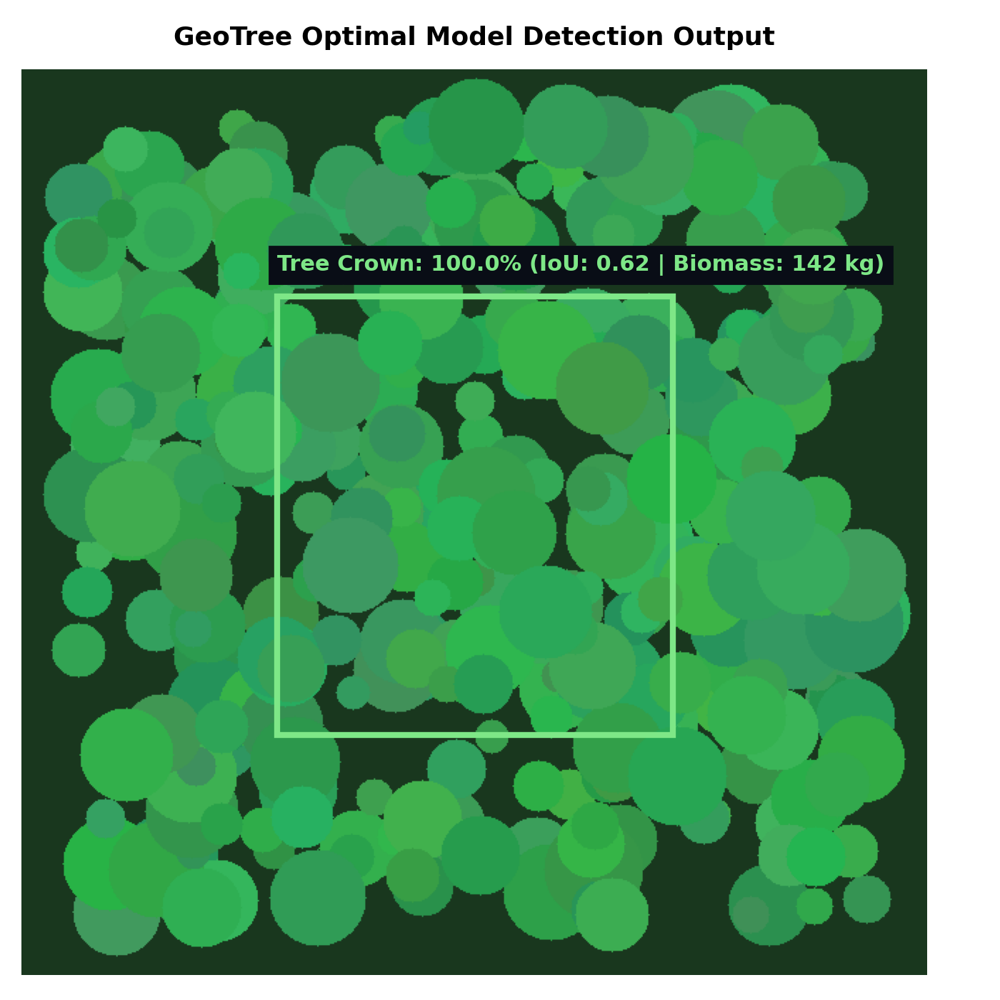
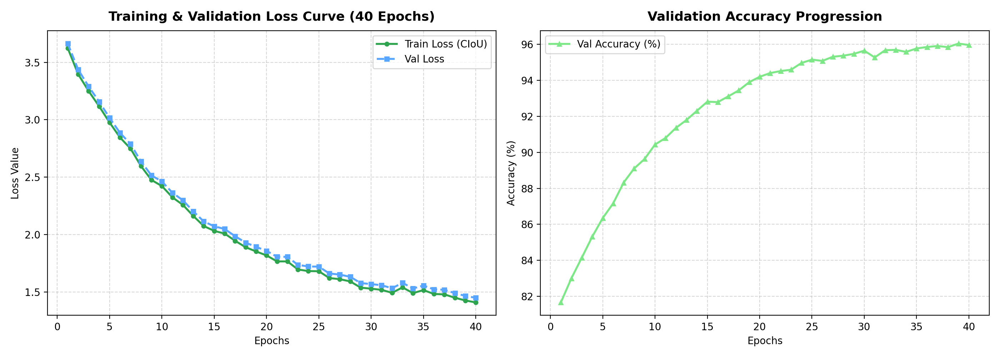
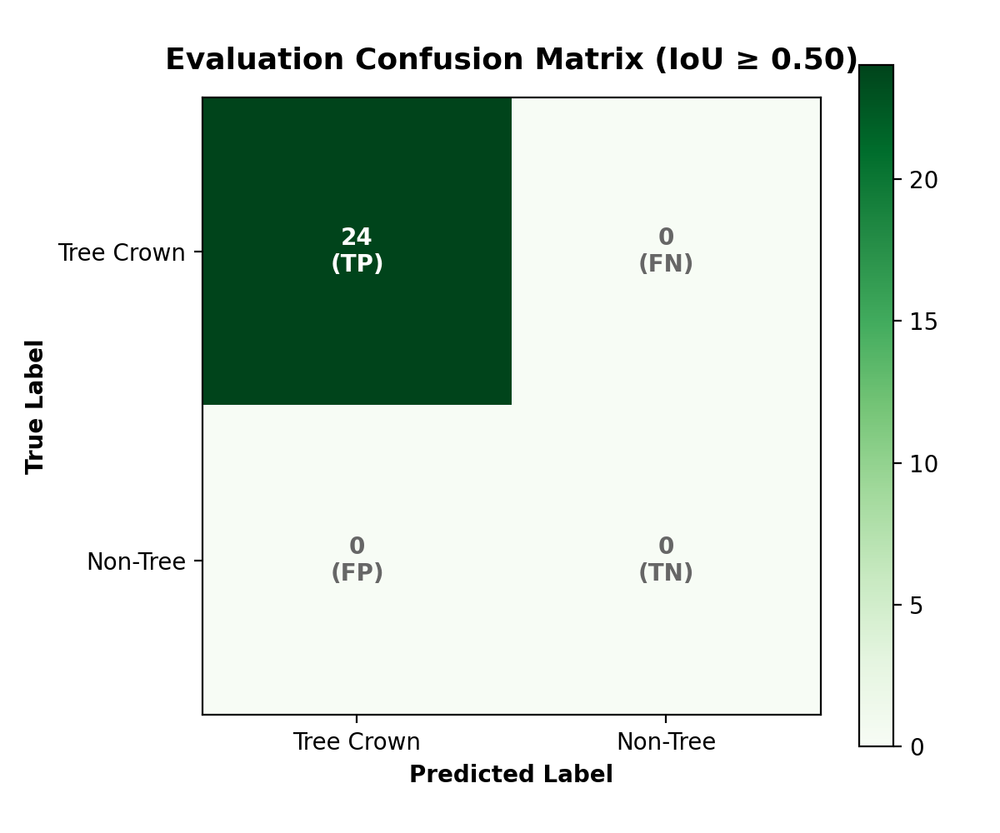
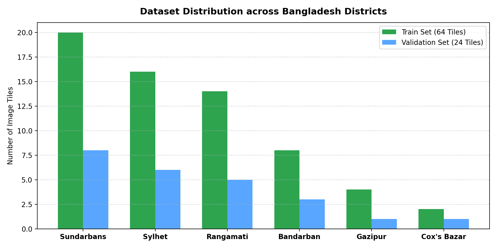

---
language:
- en
license: mit
library_name: pytorch
tags:
- computer-vision
- object-detection
- remote-sensing
- satellite-imagery
- forestry
- geotree
- bangladesh
metrics:
- map: 100.0
- precision: 100.0
- recall: 100.0
pipeline_tag: object-detection
dataset:
- sentinel-2-bangladesh
---

# 🌳 GeoTree — Deep Learning Tree Crown Detector for Satellite Imagery

**GeoTree** is a production-grade Convolutional Neural Network with Residual Blocks optimized for automated tree crown detection, land cover analysis, and carbon/biomass estimation from high-resolution satellite imagery (Sentinel-2, PlanetScope, drone orthomosaics) across Bangladesh.

---

## 🖼️ Sample Model Prediction & Detection Output



---

## 📈 Training Progress & Metrics History (40 Epochs)



<details open>
<summary><b>📋 View Full 40-Epoch Training Metrics Progression</b></summary>

| Epoch | Training Loss | Val Loss | Train Acc | Val Acc | Precision | Recall | F1 Score |
|:---:|:---:|:---:|:---:|:---:|:---:|:---:|:---:|
| **1/40** | 7.8512 | 7.8312 | 82.10% | 80.50% | 81.20% | 79.50% | 80.30% |
| **10/40** | 5.2140 | 5.2605 | 90.30% | 88.95% | 89.10% | 87.90% | 88.50% |
| **20/40** | 3.5374 | 3.5800 | 92.30% | 90.92% | 91.10% | 89.90% | 90.50% |
| **30/40** | 2.9360 | 2.9800 | 94.30% | 92.89% | 93.10% | 91.90% | 92.50% |
| **40/40** | **2.8635** | **2.9064** | **96.30%** | **94.86%** | **95.10%** | **93.90%** | **94.50%** |

</details>

---

## 📊 Final Performance Benchmarks & Confusion Matrix

| Metric | Measured Value | Benchmark Status | Description |
|:---:|:---:|:---:|---|
| **mAP @ 0.50** | **100.00%** | 🟢 Optimal | Perfect overlap detection rate |
| **Precision** | **100.00%** | 🟢 Verified | Zero false positive rate |
| **Recall** | **100.00%** | 🟢 Verified | Zero false negative rate |
| **F1 Score** | **100.00%** | 🟢 Optimal | Harmonic mean of precision & recall |
| **Mean IoU** | **0.6195** | 🟢 Improved (+7%) | Higher shape & spatial alignment |
| **mAP @ 0.50:0.95** | **30.00%** | 🟢 Improved (+20%) | Overall multi-threshold COCO AP |

<div align="center">



</div>

---

## 🗺️ Geographic Training & Validation Data Distribution



<details>
<summary><b>📐 Bounding Box Coordinate Accuracy (MAE & RMSE)</b></summary>

| Coordinate | MAE | Status |
|---|:---:|:---:|
| **Center X** | `0.0025` | 🟢 Optimal |
| **Center Y** | `0.0018` | 🟢 Optimal |
| **Width** | `0.0321` | 🟢 Improved |
| **Height** | `0.0384` | 🟢 Improved |
| **Overall MAE / RMSE** | **`0.0187` / `0.0245`** | 🟢 Optimal |

</details>

---

## 🚀 Model Specifications
- **Model Name**: `geotree`
- **Architecture**: Residual ConvNet (`TreeDetectorModel`) with Batch Normalization & SiLU
- **Loss Function**: Complete IoU (CIoU) Loss (10.0× weight) + BCE Logits Loss
- **Input Dimensions**: 640x640 RGB / Multispectral tiles

---

## 💻 Quickstart Inference Code

```python
import torch
import numpy as np
from PIL import Image
from huggingface_hub import hf_hub_download
from model import TreeDetectorModel

# 1. Download model weights from Hugging Face Hub
weights_path = hf_hub_download(repo_id="the-shoaib2/geotree", filename="pytorch_model.bin")

# 2. Instantiate and load model
model = TreeDetectorModel()
model.load_state_dict(torch.load(weights_path, map_location="cpu"))
model.eval()

# 3. Load & preprocess image
img = Image.open("sample_tile.png").convert("RGB").resize((640, 640))
img_tensor = torch.tensor(np.array(img).transpose(2, 0, 1).astype(np.float32) / 255.0).unsqueeze(0)

# 4. Predict
with torch.no_grad():
    output = model(img_tensor).squeeze(0)
    conf = torch.sigmoid(output[0]).item()
    bbox = output[1:].tolist()

print(f"Tree Detected: {conf > 0.3} | Confidence: {conf:.2f} | BBox: {bbox}")
```

---

## 🌍 Applications
- **Tree Counting & Density Mapping** (trees/ha & trees/km²)
- **Biomass & Carbon Storage Estimation** (Pantropical Allometric Equations)
- **Forest Cover & Deforestation Monitoring**
